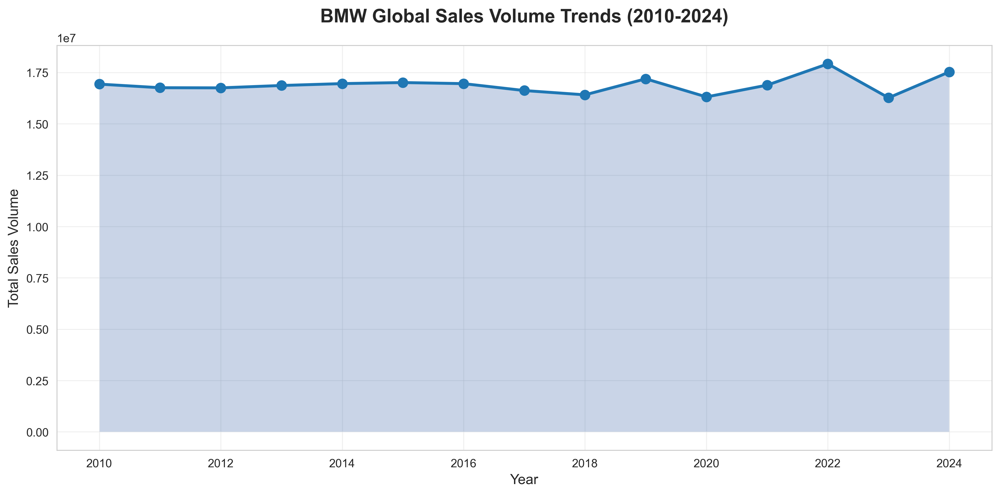
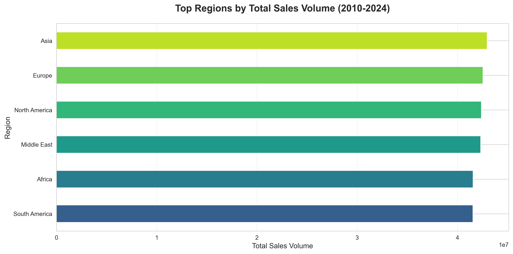
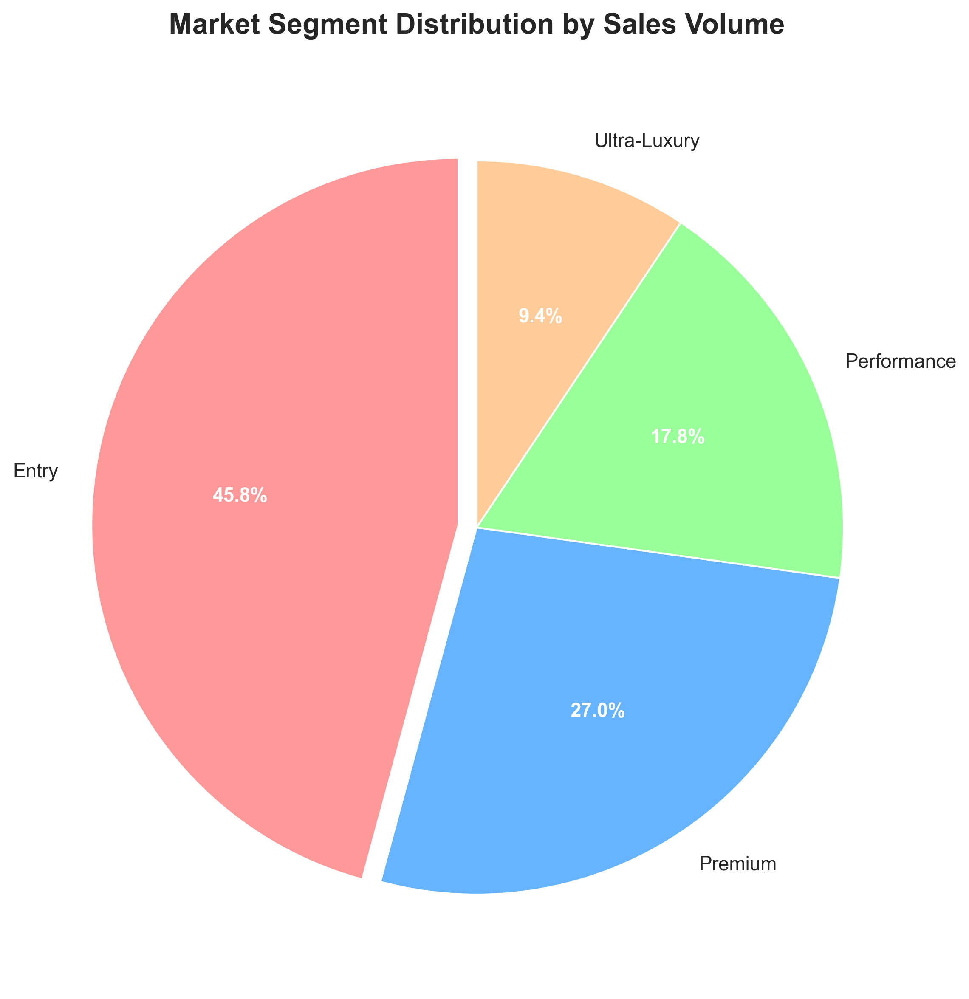
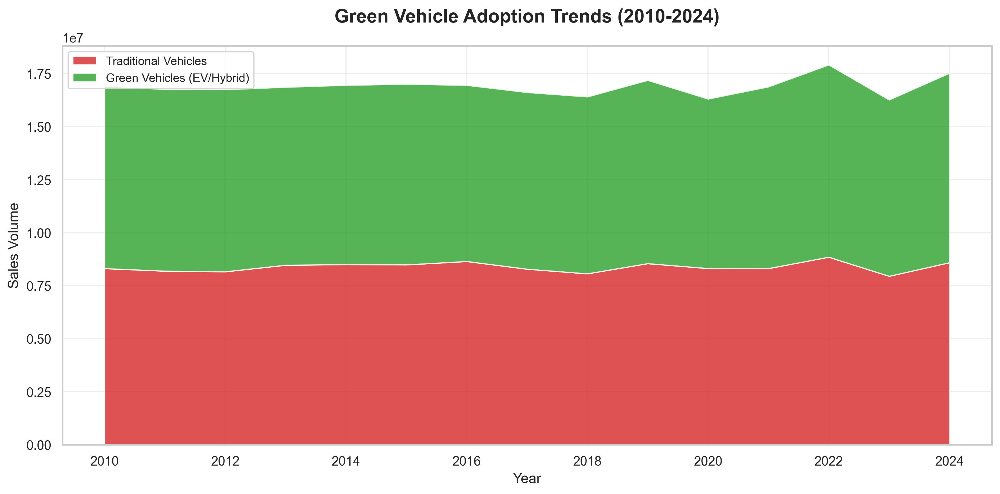
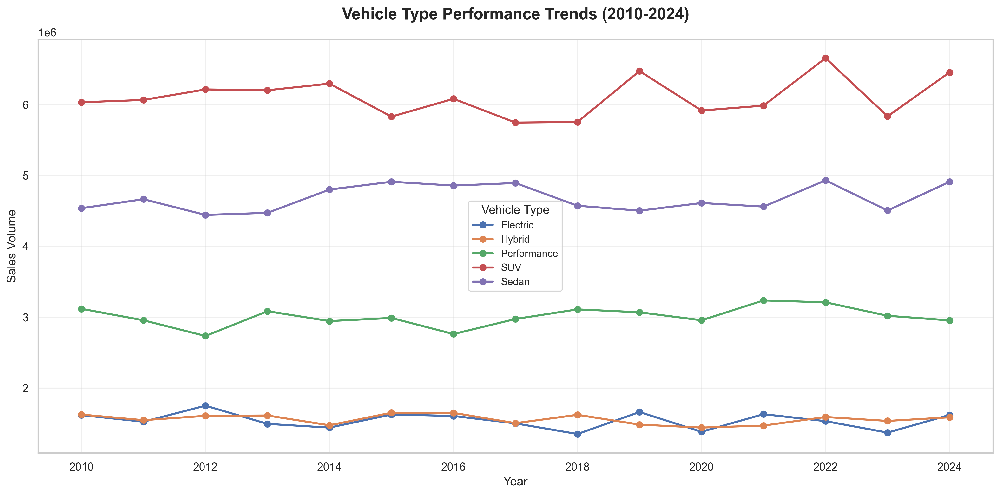

# BMW Worldwide Sales Data Analysis (2010-2024)

**Data Analysis Portfolio Project**

A comprehensive analysis of BMW's global sales performance spanning 15 years, demonstrating data cleaning, exploratory analysis, feature engineering, and business intelligence skills.

---

## 📊 Project Highlights

- **253+ million units** analyzed across 50,000 records
- **6 regions** and **11 BMW models** tracked over 15 years
- **50%+ green vehicle adoption** showing BMW's EV transition
- **Premium segment leads** with 27% market share
- **Asia** dominates regional sales, followed by Europe and North America

---

## 🎯 Project Objectives

- Clean and prepare raw sales data for analysis
- Uncover sales trends across regions, market segments, and vehicle types
- Engineer features for market segmentation and customer insights
- Create actionable visualizations and business recommendations


## 📁 Dataset

- **Source**: BMW worldwide sales records (2010-2024)
- **Size**: 50,000 records with 30+ features
- **Scope**: Multiple regions, models, fuel types, and market segments
- **Raw data**: `data/raw/BMW_Worldwide_Sales_Records_2010_2024.csv`
- **Processed data**: `data/processed/` (cleaned and feature-engineered versions)
- **Dataset link**: https://www.kaggle.com/datasets/ahmadrazakashif/bmw-worldwide-sales-records-20102024

---

## 🔍 Key Insights

### Market Performance
- **Top Region**: Asia leads with 17.0% of global sales, closely followed by Europe (16.8%) and North America (16.7%)
- **Top Model**: 7 Series is the best-performing model overall
- **Average Price**: $75,035 across all vehicles (tight bands: $74,657-$75,570 across segments)

### Green Vehicle Transition
- **50.4%** of sales are now electric or hybrid vehicles
- Clear acceleration in EV adoption from 2018 onwards
- Europe and North America lead in green vehicle preference

### Market Segmentation
- **Entry Segment**: 45.8% (mass market appeal, largest volume driver)
- **Premium**: 27.1% (core BMW positioning)
- **Performance**: 17.8% (M-series and sport models)
- **Ultra-Luxury**: 9.3% (7 Series and high-end variants, highest average price at $75,570)

### Vehicle Type Trends
- **SUVs** show strongest growth trajectory
- **Sedans** remain steady as core product line
- **Electric vehicles** gaining market share rapidly

---

## 📊 Visualizations

### Sales Trends Over Time

*BMW's global sales have remained relatively stable with a peak in 2022, showing resilience across economic cycles.*

### Regional Performance

*Asia, Europe, and North America are the three powerhouse markets for BMW worldwide.*

### Market Segment Distribution

*Entry segment dominates volume, but Premium and Performance segments drive brand value.*

### Green Vehicle Adoption

*Dramatic shift toward electric and hybrid vehicles, especially post-2016.*

### Vehicle Type Performance

*SUVs lead in absolute volume, with steady performance across all vehicle types.*

---

## 🛠️ Methods & Workflow

1. **Data Cleaning** (`notebooks/01_data_cleaning.ipynb`)
   - Load raw CSV files
   - Handle missing values (median for numeric, mode for categorical)
   - Remove duplicates
   - Normalize column names and data types
   - **Output**: `data/processed/BMW_Worldwide_Sales_Cleaned.csv`

2. **Exploratory Data Analysis** (`notebooks/02_eda.ipynb`)
   - Univariate and multivariate analysis
   - Correlation analysis
   - Seasonal and regional trend identification
   - Price-volume relationships
   - Initial visualization of key patterns

3. **Feature Engineering** (`notebooks/03_feature_engineering.ipynb`)
   - Create price categories (Budget → Luxury)
   - Define market segments based on model positioning (Entry, Premium, Performance, Ultra-Luxury)
   - Calculate vehicle age and engine power categories
   - Generate green vehicle indicators (Electric/Hybrid classification)
   - Compute market share and performance metrics
   - **Key Findings**:
     - Near-zero price-sales correlation overall (0.0), slight variations by segment
     - Entry segment dominates with 45.8% market share
     - Ultra-Luxury segment commands highest prices but smallest volume (9.3%)
     - Green vehicles now account for 50.4% of all sales
   - **Visualizations**: Market segment trends over time, average prices by segment, price vs sales analysis
   - **Output**: `data/processed/BMW_Worldwide_Sales_Features.csv`, `data/processed/yearly_sales.csv`

4. **Time Series Forecasting** (`notebooks/04_forecasting.ipynb`)
   - Prophet-based sales forecasting models
   - Trend and seasonality decomposition
   - Regional and model-level predictions
   - Forecast validation and accuracy metrics

5. **Portfolio Summary** (`notebooks/portfolio_summary.ipynb`)
   - Executive-level KPIs and metrics
   - Key visualizations for presentation
   - Business insights and recommendations
   - Export charts to `dashboards/` folder

---

## 💼 Business Recommendations

**Strategic Priorities:**
1. **Accelerate EV Portfolio**: Expand electric offerings in SUV segment to capture growing demand (already at 50%+ adoption)
2. **Regional Balance**: Maintain competitive presence across balanced regional markets (16-17% each)
3. **Segment Strategy**: 
   - Protect Entry segment (45.8% volume driver) with competitive pricing
   - Enhance Ultra-Luxury differentiation (9.3% share, highest margins at $75,570 avg)
   - Leverage tight price bands ($74,657-$75,570) to signal consistent quality
4. **Price Positioning**: Near-zero price elasticity suggests strong brand loyalty - focus on value proposition over discounting

**Data-Driven Operations:**
- Use predictive analytics for demand forecasting and inventory optimization
- Monitor segment-specific price sensitivity (slight variations: -0.022 to +0.015 correlation)
- Track regional green vehicle adoption rates to guide EV production allocation
- Leverage 7 Series performance insights to optimize flagship model marketing

---

## 🚀 How to Run

### Prerequisites
```bash
# Python 3.11+ recommended
python --version
```

### Setup

1. **Clone or download this repository**

2. **Create a virtual environment** (recommended)
```bash
python -m venv .venv
source .venv/bin/activate  # macOS/Linux
# or
.venv\Scripts\activate  # Windows
```

3. **Install dependencies**
```bash
pip install -r requirements.txt
```

### Running the Analysis

**Option 1: Portfolio Summary (Quick Start)**
```bash
jupyter notebook notebooks/portfolio_summary.ipynb
```
Run all cells to see the complete analysis with KPIs, visualizations, and insights.

**Option 2: Full Pipeline (Step-by-Step)**
```bash
jupyter notebook
# Then run notebooks in order:
# 1. 01_data_cleaning.ipynb
# 2. 02_eda.ipynb
# 3. 03_feature_engineering.ipynb
# 4. 04_forecasting.ipynb (optional - requires prophet)
# 5. portfolio_summary.ipynb
```

### Generated Outputs
- **Cleaned data**: `data/processed/BMW_Worldwide_Sales_Cleaned.csv`
- **Feature-engineered data**: `data/processed/BMW_Worldwide_Sales_Features.csv`
- **Yearly aggregated data**: `data/processed/yearly_sales.csv`
- **Visualizations**: `dashboards/*.png` (5+ key charts)

### VS Code Kernel Tip
- If VS Code shows a warning that your Python is unsupported, select a supported kernel:
   - In the notebook toolbar, click the Kernel name → choose a Python 3.11+ interpreter (venv recommended).
   - Or Command Palette → "Notebook: Select Notebook Kernel".

---

## 📦 Dependencies

See `requirements.txt` for exact versions. Core packages:
- **pandas** - Data manipulation and analysis
- **numpy** - Numerical computing
- **matplotlib** - Data visualization
- **seaborn** - Statistical visualization
- **scikit-learn** - Feature engineering and machine learning utilities
- **prophet** - Time series forecasting (used in 04_forecasting.ipynb)
- **jupyter** - Interactive notebooks
- **ipykernel** - Jupyter kernel for Python

---

## 📂 Project Structure

```
BMW-Sales-Data-Analysis/
├── README.md                          # This file
├── requirements.txt                   # Python dependencies
├── data/
│   ├── raw/                          # Original datasets
│   │   └── BMW_Worldwide_Sales_Records_2010_2024.csv
│   └── processed/                    # Cleaned and feature-engineered data
│       ├── BMW_Worldwide_Sales_Cleaned.csv
│       ├── BMW_Worldwide_Sales_Features.csv
│       └── yearly_sales.csv
├── notebooks/
│   ├── 01_data_cleaning.ipynb        # Data cleaning pipeline
│   ├── 02_eda.ipynb                  # Exploratory analysis
│   ├── 03_feature_engineering.ipynb  # Feature creation
│   ├── 04_forecasting.ipynb          # Time series forecasting with Prophet
│   └── portfolio_summary.ipynb       # Executive summary notebook
├── dashboards/
│   ├── sales_trends.png              # Global sales over time
│   ├── regional_sales.png            # Regional performance
│   ├── market_segments.png           # Segment distribution
│   ├── green_vehicle_adoption.png    # EV/Hybrid trends
│   └── vehicle_type_trends.png       # Vehicle type performance
├── scripts/
│   ├── data_cleaning.py              # Reusable cleaning functions
│   ├── data_analysis.py              # Analysis utilities
│   └── visualization.py              # Plotting helpers
└── reports/
    └── project_summary.md            # Detailed project documentation
```

---

## 🎓 Skills Demonstrated

This project showcases:
- **Data Cleaning**: Handling missing values, duplicates, data type conversions
- **Exploratory Data Analysis**: Statistical analysis, correlation studies, trend identification
- **Feature Engineering**: Creating derived variables, segmentation, metric calculation
- **Data Visualization**: Clear, professional charts using matplotlib and seaborn
- **Business Intelligence**: Translating data insights into actionable recommendations
- **Python Programming**: Efficient use of pandas, numpy, and scikit-learn
- **Documentation**: Well-structured notebooks with markdown explanations

---

## 🔗 Related Files

- **Detailed Report**: See `reports/project_summary.md` for comprehensive analysis documentation
- **Notebooks**: All analysis notebooks in `notebooks/` folder
- **Visualizations**: High-resolution charts in `dashboards/` folder
````